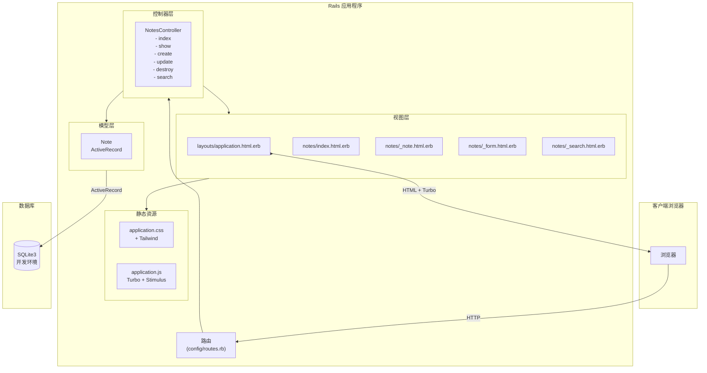
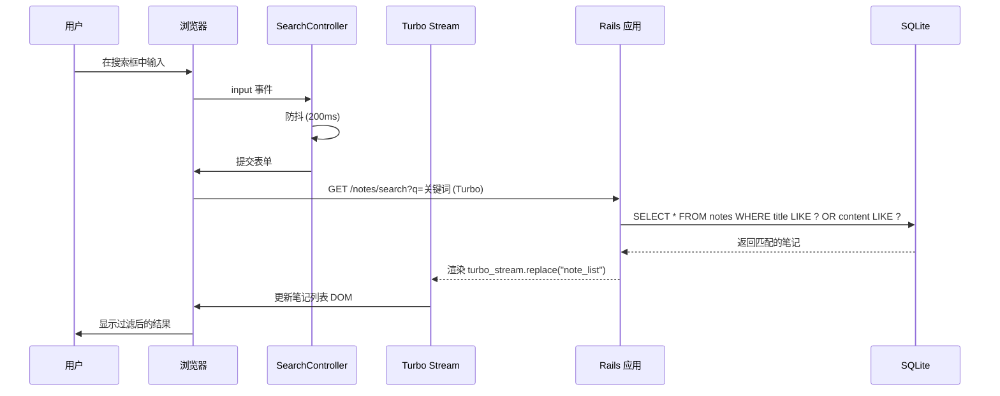
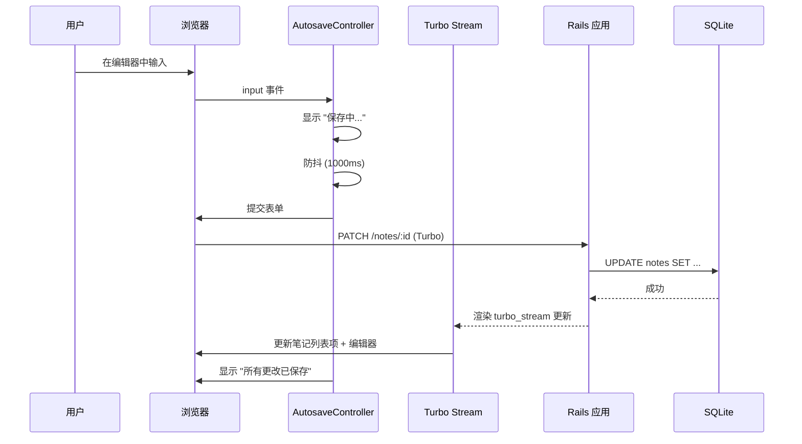

# Simplenote 设计文档

**版本**: 1.0  
**日期**: 2026-03-11  
**基于**: PRD v1.0 & 技术栈规范

---

## 1. 系统架构

### 1.1 概述

Simplenote 采用基于 Ruby 3.3.6 + Rails 8.1.2 的单体 MVC 架构，使用服务端渲染。



### 1.2 设计原则

| 原则 | 实现方式 |
|------|---------|
| 约定优于配置 | 标准 Rails MVC 模式，RESTful 路由 |
| 渐进增强 | 核心功能无需 JS 即可工作；通过 Turbo/Stimulus 增强体验 |
| 服务端渲染 | ERB 模板实现快速首屏加载和 SEO |
| 最小化 JavaScript | Turbo 处理导航，Stimulus 处理特定交互 |

---

## 2. 数据模型设计

### 2.1 实体定义

**Note（笔记）实体**

| 字段 | 类型 | 约束 | 说明 |
|------|------|------|------|
| `id` | integer | 主键，自增 | 系统生成 |
| `title` | string | 可选，最多 255 字符 | 笔记标题，为空时显示 "Untitled" |
| `content` | text | 可选 | 笔记内容，支持长文本 |
| `created_at` | datetime | 非空，自动设置 | 记录创建时间戳 |
| `updated_at` | datetime | 非空，自动更新 | 最后修改时间戳 |

### 2.2 ActiveRecord 模型

```ruby
# app/models/note.rb
class Note < ApplicationRecord
  # 验证：笔记必须包含标题或内容
  validate :must_have_content

  # 作用域
  scope :recent, -> { order(updated_at: :desc) }
  scope :search, ->(query) {
    where("title LIKE ? OR content LIKE ?", "%#{query}%", "%#{query}%")
  }

  # 实例方法
  def display_title
    title.presence || "Untitled"
  end

  def preview_content(length = 50)
    content.to_s.truncate(length)
  end

  def friendly_time
    updated_at.friendly_format  # 使用 timeago 或 rails-timeago
  end

  private

  def must_have_content
    if title.blank? && content.blank?
      errors.add(:base, "笔记必须包含标题或内容")
    end
  end
end
```

### 2.3 数据库迁移

```ruby
# db/migrate/20260311000001_create_notes.rb
class CreateNotes < ActiveRecord::Migration[8.0]
  def change
    create_table :notes do |t|
      t.string :title, null: true
      t.text :content, null: true

      t.timestamps
    end

    # 为搜索性能添加索引
    add_index :notes, :updated_at
  end
end
```

---

## 3. 路由设计

### 3.1 RESTful 路由

```ruby
# config/routes.rb
Rails.application.routes.draw do
  root "notes#index"

  resources :notes do
    collection do
      get :search  # GET /notes/search?q=keyword
    end
  end
end
```

### 3.2 路由表

| HTTP 方法 | 路径 | 控制器#动作 | 用途 |
|-----------|------|------------|------|
| GET | / | notes#index | 应用首页，显示笔记列表并选中第一个笔记 |
| GET | /notes | notes#index | 列出所有笔记 |
| POST | /notes | notes#create | 创建新笔记 |
| GET | /notes/:id | notes#show | 显示特定笔记（用于直接链接） |
| PATCH | /notes/:id | notes#update | 更新笔记（自动保存端点） |
| DELETE | /notes/:id | notes#destroy | 删除笔记 |
| GET | /notes/search | notes#search | 根据查询条件搜索笔记 |

---

## 4. 控制器设计

### 4.1 NotesController

```ruby
# app/controllers/notes_controller.rb
class NotesController < ApplicationController
  before_action :set_note, only: [:show, :update, :destroy]

  # GET /notes
  def index
    @notes = Note.recent
    @note = @notes.first || Note.new  # 选中第一个笔记或显示空状态
    @query = params[:q]
  end

  # GET /notes/:id
  def show
    @notes = Note.recent
    render :index
  end

  # POST /notes
  def create
    @note = Note.new(note_params)

    if @note.save
      redirect_to note_path(@note), notice: "笔记已创建"
    else
      render :index, status: :unprocessable_entity
    end
  end

  # PATCH /notes/:id
  def update
    if @note.update(note_params)
      # Turbo Stream 响应用于部分更新
      respond_to do |format|
        format.html { redirect_to @note }
        format.turbo_stream do
          render turbo_stream: [
            turbo_stream.replace(@note, partial: "notes/note", locals: { note: @note }),
            turbo_stream.replace("editor", partial: "notes/editor", locals: { note: @note })
          ]
        end
      end
    else
      render :index, status: :unprocessable_entity
    end
  end

  # DELETE /notes/:id
  def destroy
    @note.destroy

    next_note = Note.recent.first
    if next_note
      redirect_to note_path(next_note), notice: "笔记已删除"
    else
      redirect_to root_path, notice: "笔记已删除"
    end
  end

  # GET /notes/search
  def search
    @query = params[:q]
    @notes = @query.present? ? Note.search(@query).recent : Note.recent

    respond_to do |format|
      format.turbo_stream do
        render turbo_stream: turbo_stream.replace(
          "note_list",
          partial: "notes/note_list",
          locals: { notes: @notes, query: @query }
        )
      end
      format.html { render :index }
    end
  end

  private

  def set_note
    @note = Note.find(params[:id])
  end

  def note_params
    params.require(:note).permit(:title, :content)
  end
end
```

---

## 5. 视图层设计

### 5.1 模板结构

```
app/views/
├── layouts/
│   └── application.html.erb      # 主布局，包含 HTML 结构
└── notes/
    ├── index.html.erb            # 主页面（侧边栏 + 编辑器）
    ├── _sidebar.html.erb         # 侧边栏组件（搜索 + 新建 + 列表）
    ├── _search.html.erb          # 搜索表单组件
    ├── _note_list.html.erb       # 笔记列表容器（Turbo Frame）
    ├── _note.html.erb            # 列表中的单个笔记项
    ├── _editor.html.erb          # 编辑器面板（Turbo Frame）
    └── _form.html.erb            # 笔记编辑表单
```

### 5.2 布局设计

```erb
<!-- app/views/layouts/application.html.erb -->
<!DOCTYPE html>
<html>
  <head>
    <title>Simplenote</title>
    <%= csrf_meta_tags %>
    <%= csp_meta_tag %>
    <%= stylesheet_link_tag "application", "data-turbo-track": "reload" %>
    <%= javascript_importmap_tags %>
  </head>
  <body class="bg-gray-50 h-screen">
    <%= yield %>
  </body>
</html>
```

### 5.3 主页面结构

```erb
<!-- app/views/notes/index.html.erb -->
<div class="flex h-screen">
  <!-- 侧边栏 -->
  <%= render "sidebar", notes: @notes, note: @note, query: @query %>

  <!-- 编辑器面板 -->
  <%= turbo_frame_tag "editor" do %>
    <%= render "editor", note: @note %>
  <% end %>
</div>
```

### 5.4 侧边栏组件

```erb
<!-- app/views/notes/_sidebar.html.erb -->
<aside class="w-80 bg-white border-r flex flex-col h-full">
  <!-- 搜索 -->
  <div class="p-4 border-b">
    <%= render "search", query: query %>
  </div>

  <!-- 新建笔记按钮 -->
  <div class="p-4 border-b">
    <%= link_to "+ 新建笔记", notes_path,
                data: { turbo_method: :post },
                class: "w-full block text-center bg-blue-600 text-white px-4 py-2 rounded" %>
  </div>

  <!-- 笔记列表 -->
  <%= turbo_frame_tag "note_list" do %>
    <%= render "note_list", notes: notes, active_note: note %>
  <% end %>
</aside>
```

### 5.5 搜索组件

```erb
<!-- app/views/notes/_search.html.erb -->
<%= form_with url: search_notes_path,
              method: :get,
              data: { controller: "search", action: "input->search#submit" },
              class: "relative" do |f| %>
  <%= f.text_field :q,
                   value: query,
                   placeholder: "搜索笔记...",
                   class: "w-full pl-10 pr-4 py-2 border rounded",
                   data: { search_target: "input" } %>
  <span class="absolute left-3 top-2.5 text-gray-400">
    <svg><!-- 搜索图标 --></svg>
  </span>
<% end %>
```

### 5.6 笔记列表组件

```erb
<!-- app/views/notes/_note_list.html.erb -->
<div class="flex-1 overflow-y-auto">
  <% if notes.empty? %>
    <!-- 空状态 -->
    <div class="p-8 text-center text-gray-500">
      <p>未找到笔记</p>
      <p class="text-sm mt-2">创建第一条笔记开始使用</p>
    </div>
  <% else %>
    <% notes.each do |note| %>
      <%= render "note", note: note, active: note == active_note %>
    <% end %>
  <% end %>
</div>
```

### 5.7 笔记项组件

```erb
<!-- app/views/notes/_note.html.erb -->
<%= link_to note_path(note),
            class: "block p-4 border-b hover:bg-gray-50 #{active ? 'bg-blue-50 border-l-4 border-l-blue-600' : ''}",
            data: { turbo_frame: "editor" } do %>
  <h3 class="font-medium truncate <%= active ? 'text-blue-900' : 'text-gray-900' %>">
    <%= note.display_title %>
  </h3>
  <p class="text-sm text-gray-500 truncate mt-1">
    <%= note.preview_content %>
  </p>
  <time class="text-xs text-gray-400 mt-2 block">
    <%= time_ago_in_words(note.updated_at) %> 前
  </time>
<% end %>
```

### 5.8 编辑器组件

```erb
<!-- app/views/notes/_editor.html.erb -->
<div class="flex-1 flex flex-col h-full bg-white">
  <% if note.new_record? && notes.empty? %>
    <!-- 新用户的空状态 -->
    <%= render "empty_state" %>
  <% else %>
    <!-- 编辑器表单 -->
    <%= form_with model: note,
                  data: { controller: "autosave", autosave_delay_value: 1000 },
                  class: "flex-1 flex flex-col" do |f| %>

      <!-- 标题输入框 -->
      <div class="border-b px-8 py-4">
        <%= f.text_field :title,
                         placeholder: "笔记标题",
                         class: "w-full text-xl font-semibold border-none focus:ring-0",
                         data: { action: "input->autosave#save" } %>
      </div>

      <!-- 内容文本域 -->
      <div class="flex-1 px-8 py-4">
        <%= f.text_area :content,
                        placeholder: "开始写作...",
                        class: "w-full h-full resize-none border-none focus:ring-0",
                        data: { action: "input->autosave#save" } %>
      </div>

      <!-- 状态栏 -->
      <div class="border-t px-8 py-2 flex justify-between items-center text-sm text-gray-500">
        <span data-autosave-target="status">所有更改已保存</span>

        <!-- 删除按钮 -->
        <%= link_to note_path(note),
                    data: { turbo_method: :delete, turbo_confirm: "确定删除此笔记？" },
                    class: "text-red-600 hover:text-red-800" do %>
          <svg><!-- 删除图标 --></svg> 删除
        <% end unless note.new_record? %>
      </div>
    <% end %>
  <% end %>
</div>
```

---

## 6. UI 组件设计

### 6.1 布局结构

```
+------------------ 窗口 (100vh) ------------------+
|                                                    |
|  +---------- 侧边栏 (320px) +------------------+ |
|  |                            |                  | |
|  |  +---------------------+   |                  | |
|  |  | 搜索框              |   |   编辑器面板     | |
|  |  +---------------------+   |   (flex: 1)        | |
|  |                            |                  | |
|  |  +---------------------+   |   +------------+ | |
|  |  | [+ 新建笔记]        |   |   | 标题       | | |
|  |  +---------------------+   |   +------------+ | |
|  |                            |                  | |
|  |  +---------------------+   |   +------------+ | |
|  |  | 笔记列表            |   |   | 内容       | | |
|  |  | - 笔记 1            |   |   |            | | |
|  |  | - 笔记 2            |   |   |            | | |
|  |  | - 笔记 3            |   |   |            | | |
|  |  +---------------------+   |   +------------+ | |
|  |                            |                  | |
|  |                            |   +------------+ | |
|  |                            |   | 状态栏     | | |
|  |                            |   +------------+ | |
|  +----------------------------+------------------+ |
|                                                    |
+----------------------------------------------------+
```

### 6.2 Stimulus 控制器

```javascript
// app/javascript/controllers/autosave_controller.js
import { Controller } from "@hotwired/stimulus"

export default class extends Controller {
  static targets = ["status"]
  static values = { delay: Number }

  connect() {
    this.timeout = null
  }

  save() {
    this.statusTarget.textContent = "保存中..."
    clearTimeout(this.timeout)

    this.timeout = setTimeout(() => {
      this.element.requestSubmit()
    }, this.delayValue)
  }

  // Turbo Stream 更新后的成功回调
  saved() {
    this.statusTarget.textContent = "所有更改已保存"
  }
}
```

```javascript
// app/javascript/controllers/search_controller.js
import { Controller } from "@hotwired/stimulus"

export default class extends Controller {
  static targets = ["input"]

  submit() {
    // 搜索输入防抖
    clearTimeout(this.timeout)
    this.timeout = setTimeout(() => {
      this.element.requestSubmit()
    }, 200)
  }
}
```

---

## 7. 搜索功能设计

### 7.1 搜索流程



### 7.2 搜索实现

```ruby
# app/models/note.rb
scope :search, ->(query) {
  return none if query.blank?
  where(
    "title LIKE ? OR content LIKE ?",
    "%#{sanitize_sql_like(query)}%",
    "%#{sanitize_sql_like(query)}%"
  )
}
```

---

## 8. 自动保存机制

### 8.1 保存流程



### 8.2 自动保存策略

| 方面 | 实现方式 |
|------|---------|
| 触发条件 | 标题和内容字段的 `input` 事件 |
| 防抖延迟 | 用户停止输入后 1000ms |
| 视觉反馈 | 状态文本："保存中..." -> "所有更改已保存" |
| 服务器请求 | PATCH /notes/:id，Turbo Stream 响应 |
| 部分更新 | 更新笔记列表项的时间戳和预览 |

---

## 9. 项目结构

### 9.1 目录布局

```
simplenote/
├── app/
│   ├── controllers/
│   │   ├── application_controller.rb
│   │   └── notes_controller.rb
│   ├── models/
│   │   └── note.rb
│   ├── views/
│   │   ├── layouts/
│   │   │   └── application.html.erb
│   │   └── notes/
│   │       ├── index.html.erb
│   │       ├── _sidebar.html.erb
│   │       ├── _search.html.erb
│   │       ├── _note_list.html.erb
│   │       ├── _note.html.erb
│   │       ├── _editor.html.erb
│   │       ├── _form.html.erb
│   │       └── _empty_state.html.erb
│   ├── assets/
│   │   ├── stylesheets/
│   │   │   └── application.css
│   │   └── javascript/
│   │       ├── application.js
│   │       └── controllers/
│   │           ├── index.js
│   │           ├── autosave_controller.js
│   │           └── search_controller.js
│   └── helpers/
│       └── notes_helper.rb
├── config/
│   ├── routes.rb
│   └── database.yml
├── db/
│   ├── migrate/
│   │   └── 20260311000001_create_notes.rb
│   └── schema.rb
├── test/
│   ├── controllers/
│   │   └── notes_controller_test.rb
│   ├── models/
│   │   └── note_test.rb
│   └── system/
│       └── notes_test.rb
├── Gemfile
└── README.md
```

### 9.2 关键依赖

```ruby
# Gemfile
gem "rails", "~> 8.1.2"
gem "sqlite3", "~> 1.4"      # 开发环境数据库
gem "turbo-rails"            # SPA 式导航
gem "stimulus-rails"         # JavaScript 控制器
gem "tailwindcss-rails"      # 样式框架
```

---

## 10. 实现计划

### 10.1 第一阶段：核心搭建

| 任务 | 描述 | 交付物 |
|------|------|--------|
| 1.1 | 使用 `rails new` 创建 Rails 项目 | 项目脚手架 |
| 1.2 | 配置数据库并运行迁移 | 数据库就绪 |
| 1.3 | 设置 Tailwind CSS 和 importmap | 样式就绪 |

### 10.2 第二阶段：数据层

| 任务 | 描述 | 交付物 |
|------|------|--------|
| 2.1 | 生成带迁移的 Note 模型 | `app/models/note.rb` |
| 2.2 | 实现模型验证和作用域 | 控制台中可用的 CRUD |
| 2.3 | 编写模型测试 | 测试通过 |

### 10.3 第三阶段：基础 UI

| 任务 | 描述 | 交付物 |
|------|------|--------|
| 3.1 | 生成带脚手架的 NotesController | 带 CRUD 操作的控制器 |
| 3.2 | 创建主布局（侧边栏 + 编辑器） | 可工作的 `index.html.erb` |
| 3.3 | 实现笔记列表视图 | 列表显示笔记 |
| 3.4 | 实现基础编辑器表单 | 可工作的创建和编辑 |

### 10.4 第四阶段：交互功能

| 任务 | 描述 | 交付物 |
|------|------|--------|
| 4.1 | 实现 Turbo 导航 | SPA 式页面过渡 |
| 4.2 | 添加 Stimulus 自动保存控制器 | 带防抖的自动保存 |
| 4.3 | 添加 Stimulus 搜索控制器 | 实时搜索 |
| 4.4 | 实现带确认的删除 | 安全的删除流程 |

### 10.5 第五阶段：完善

| 任务 | 描述 | 交付物 |
|------|------|--------|
| 5.1 | 空状态和错误处理 | 友好的用户体验 |
| 5.2 | 使用 timeago 格式化时间 | 显示 "2 分钟前" |
| 5.3 | 编写系统测试 | 完整的测试覆盖 |
| 5.4 | 最终样式和响应式 | 生产就绪的 UI |

### 10.6 验收标准

| 需求 | 验证方式 |
|------|---------|
| 笔记 CRUD | 可创建、读取、更新、删除笔记 |
| 自动保存 | 停止输入后 1 秒内自动保存更改 |
| 实时搜索 | 输入后 200 毫秒内更新搜索结果 |
| 性能 | 页面加载小于 3 秒，列表更新小于 100 毫秒 |
| 浏览器支持 | 可在 Chrome、Firefox、Safari、Edge 最新版本运行 |

---

## 11. 附录

### 11.1 术语表

| 术语 | 定义 |
|------|------|
| Turbo | Hotwire 组件，实现无页面刷新的 SPA 式导航 |
| Stimulus | 以 HTML 为中心的 JavaScript 框架 |
| ERB | 嵌入式 Ruby 模板语言 |
| ActiveRecord | Rails 的数据库 ORM |
| RESTful | 使用 HTTP 动词和基于资源 URL 的架构风格 |

### 11.2 参考文档

- [Rails Guides](https://guides.rubyonrails.org/)
- [Hotwire Documentation](https://hotwired.dev/)
- [Tailwind CSS](https://tailwindcss.com/)
- [Simplenote PRD](./simplenote-prd.md)
- [Tech Stack Specification](./tech_stack.md)
